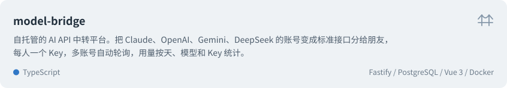
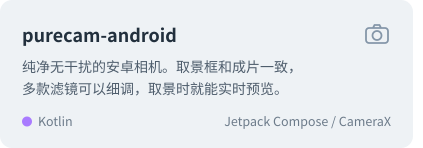
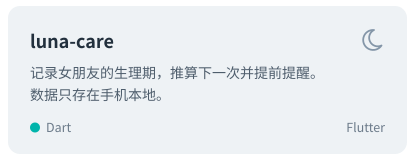
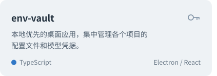
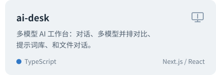
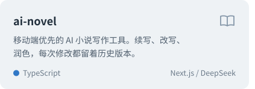
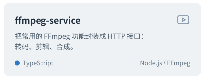

全栈开发者。这里的项目大多先做给自己用，好用了就开源。博客在 [calmliming.github.io](https://calmliming.github.io)。

### 项目

### 常用技术

<picture>
  <source media="(prefers-color-scheme: dark)" srcset="https://skillicons.dev/icons?i=ts%2Cnodejs%2Cnextjs%2Creact%2Cvue%2Ctailwind%2Celectron%2Cflutter%2Ckotlin%2Cpostgres%2Cdocker&theme=dark">
  
</picture>
